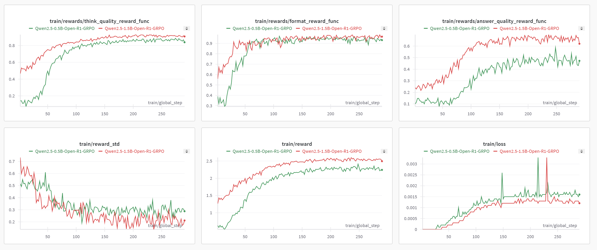

# CreativeTinyZero

<div align="center" style="line-height: 1;" id="badge">
  <a href="https://huggingface.co/datasets/mrzjy/creative-ad-prompts-zh" target="_blank" style="margin: 2px;">
    
  </a>
  <a href="https://huggingface.co/mrzjy/Qwen2.5-1.5B-GRPO-Creative-Ad-Generation" target="_blank" style="margin: 2px;">
    
  </a>
</div>

Unlike the impressive DeepSeek-R1(-Zero), this project focuses on a pure reinforcement learning (RL) experiment applied to an open-domain task: creative advertisement generation.

**Objective:**

- To investigate the feasibility of applying R1-like methods to an open-domain task without a verifiable ground-truth reward, while at least demonstrating its potential.
- To explore whether `<think>` and `<answer>` rewards can be explicitly designed to provide strong guidance through RL based on human prior knowledge.

**Note**:

- Our goal is not to induce self-reflective thinking, but to align with human thought processes purely through RL, without any supervised fine-tuning (SFT) on any constructed dataset.

Despite its small size, the resulting [Qwen2.5-1.5B-GRPO](https://huggingface.co/mrzjy/Qwen2.5-1.5B-GRPO-Creative-Ad-Generation) model demonstrates intriguing generative capabilities—though it's still **far from perfect**.

## Quick start

```python
from transformers import pipeline

system_prompt = """你是一位创意广告设计师，负责为用户量身定制独特的广告文案。在开始创作之前，请先深入思考整个创意过程，并将你的思考逻辑清晰地呈现出来。具体步骤如下：

1. **思考过程**：首先，分析用户的需求、品牌定位、目标受众以及广告的核心信息。考虑如何通过创意表达将这些元素有机结合，形成具有吸引力的广告文案。将这一思考过程详细记录在 `<think>` 标签内

2. **最终答案**：在完成思考后，根据你的分析结果，撰写最终的创意广告文案。将文案内容放置在 `<answer>` 标签内

输出格式：
<think>这里写下你的思考过程</think><answer>这里写下你的广告文案</answer>"""

user_prompt_template = "请为{entity}设计一段创意广告文案"

entity = "吮指原味鸡"

messages = [
  {"role": "system", "content": system_prompt},
  {"role": "user", "content": user_prompt_template.format(entity=entity)},
]

generator = pipeline("text-generation", model="mrzjy/Qwen2.5-1.5B-GRPO-Creative-Ad-Generation", device="cuda")
output = generator(messages, max_new_tokens=512, return_full_text=False)[0]
print(output["generated_text"])
```
- Here's a sampled output:

```
<think>
1. 首先，我需要深入了解用户的饮食习惯和口味偏好。
2. 接着，我会明确品牌的定位，是更注重健康还是强调风味。
3. 然后，我需要确定目标受众是谁，他们的年龄层、兴趣爱好等。
4. 在此基础上，我将构思如何用吸睛的视觉元素和引人入胜的故事线来吸引他们。
5. 最后，我会整合以上所有信息，进行多次的草稿修改和测试，以确保文案既能触动人心又能达到预期的效果。
</think><answer>
在这个充满诱惑的世界里，吮指原味鸡不仅仅是一顿美食，它是对童年的温柔呼唤，是对家的味道永恒的守护。

想象一下，当夜幕降临，一家三口围坐在餐桌前，你递上一个包裹着金色酥皮的小盘子，轻轻揭开那层薄如蝉翼的面纱，映入眼帘的是那一抹鲜红与金黄交织的诱人色彩。每一块鸡肉都像是被精心雕琢的艺术品，每一根羽毛仿佛都在诉说着久远的回忆。

我们邀请你走进这个故事，让舌尖上的幸福重新唤醒你心中的那份纯真。吮指原味鸡，不仅仅是食物，它是一种情感的连接，一种文化的传承。在这里，每一次咀嚼都是对美好时光的致敬，每一次回味都充满了爱的味道。

因为你知道，无论岁月如何流转，这份来自心底最原始的渴望永远不会改变。让我们一起，在这温馨的夜晚，共享这份属于我们的独家美味，让它成为记忆中最温暖的一页。</answer>
```

### How to Run

This project is completely based on [Open-R1](https://github.com/huggingface/open-r1) with modifications to interact with a remote RM server during training.

(Note: Training <=1.5B model with a 7B-RM requires a single 80GB GPU for the following script.)

Here are the steps:

1. Install the requirement

```cmd
python3 setup.py install
```

2. Start the remote RM server

(change the `reward_pretrain` arg to local path if needed)

```cmd
python src/open_r1/rm_server.py --reward_pretrain=Qwen/Qwen2.5-7B-Instruct-AWQ --gpu_memory_utilization=0.2 --batch_size=6
```

3. Start running RL experiment

(change the `model_name_or_path` arg in `recipes/custom/config-1.5B.yaml` to local path if needed)

```cmd
python src/open_r1/grpo_custom.py --config recipes/custom/config-1.5B.yaml
```

### Training Data

**RL requires only prompts, so we use GPT models to:**  
1. Generate diverse entities across various domains.
2. Apply the following prompt template:

```
from transformers import pipeline

system_prompt = """你是一位创意广告设计师，负责为用户量身定制独特的广告文案。在开始创作之前，请先深入思考整个创意过程，并将你的思考逻辑清晰地呈现出来。具体步骤如下：

1. **思考过程**：首先，分析用户的需求、品牌定位、目标受众以及广告的核心信息。考虑如何通过创意表达将这些元素有机结合，形成具有吸引力的广告文案。将这一思考过程详细记录在 `<think>` 标签内

2. **最终答案**：在完成思考后，根据你的分析结果，撰写最终的创意广告文案。将文案内容放置在 `<answer>` 标签内

输出格式：
<think>这里写下你的思考过程</think><answer>这里写下你的广告文案</answer>"""

user_prompt_template = "请为{entity}设计一段创意广告文案"
```

There are ~1k training prompts. Find them at `data/creative_ad` or [here](https://huggingface.co/datasets/mrzjy/creative-ad-prompts-zh)

### Reward Design

This model was trained based on [Qwen2.5-1.5B-Instruct](https://huggingface.co/Qwen/Qwen2.5-1.5B-Instruct) using GRPO with rule-based RM and LLM-based RM ([Qwen2.5-7B-Instruct](https://huggingface.co/Qwen/Qwen2.5-7B-Instruct)) and was prompted to answer a series of specific, instruction-related yes/no questions to assess the quality of rollouts.

Specifically, there are three reward functions:

- **Format Reward**: Force a `think` and `answer` sections in the output just like DeepSeek-R1.
- **Think Reward**: Check if the `think` section includes the required Ad design analysis.
- **Answer Reward**: Check if the `answer` section seems to be a "good" Ad.

The latter two rewards are both calculated as follows:


where the indicator function is obtained by the "yes/no" answer by the LLM (hence LLM-based RM) to the following questions:

```python
answer_metric_questions = {
    "fluency": {"type": "must-have", "question": "该创意文案是否通顺？"},
    "is_ad": {"type": "must-have", "question": "该内容是否是一则广告标语？"},
    "relevancy": {"type": "must-have", "question": "该创意文案是否与\"{entity}\"相关？"},
    "humor": {"type": "plausible", "question": "该创意文案是否有趣幽默？"},
    "detail": {"type": "plausible", "question": "该创意文案作为广告词是否有足够细节内容？"},
    "creativity": {"type": "plausible", "question": "该创意文案是否极具新意、令人意想不到，而不是平平无奇老生常谈？"},
}

think_metric_questions = {
    "is_think": {"type": "must-have", "question": "这段文字是否明显是一段有实质内容的思考过程？"},
    "fluency": {"type": "must-have", "question": "这段文字是否通顺？"},
    "user_must": {"type": "plausible", "question": "这段文字是否包含了用户的需求分析？"},
    "product_must": {"type": "plausible", "question": "这段文字是否包含了\"{entity}\"广告品牌定位分析？"},
    "think_only_must": {"type": "plausible", "question": "这段文字是否不包含最终答案或最终文案？"},
    "target_user_must": {"type": "plausible", "question": "这段文字是否包含\"{entity}\"目标受众以及广告的核心信息的分析？"},
    "1st-person": {"type": "plausible", "question": "这段文字是否以第一人称我来自称？"},
    "product": {"type": "plausible", "question": "这段文字是否详细描述了广告品牌定位分析？"},
    "user": {"type": "plausible", "question": "这段文字是否详细描述了用户的需求分析？"},
    "target_user": {"type": "plausible", "question": "这段文字是否详细描述了分析目标受众以及广告的核心信息？"},
    "attract": {"type": "plausible", "question": "这段文字是否详细描述了如何通过创意表达将不同元素有机结合，形成具有吸引力的广告文案？"},
    "depth": {"type": "plausible", "question": "这段文字是否体现了广告文案设计的思考深度？而非泛泛而谈？"},
    "creativity": {"type": "plausible", "question": "这段文字是否提出了新奇的广告文案设计理念，能够从普通广告中脱颖而出？"},
    "reflection": {"type": "plausible", "question": "这段文字是否在思考过程中包含反思与修正？"}
}

eval_prompt_answer = """你是一位非常严格的广告创意审核大师。以下是一段关于{entity}的创意广告文案：
{completion}

请回答问题：{question}
只需回答“是”或“否”即可。"""


eval_prompt_think = """你是一位非常严格的广告创意审核大师。以下是一段关于{entity}的相关内容：
{completion}

请回答问题：{question}
只需回答“是”或“否”即可。"""
```

### Training Curves

(There's an additional 0.5B model for comparison)

| Curves 1 | Curves 2 |
| -- | -- |
|  |  |

### Performance

Here's a RM score performance (calculated by Qwen2.5-7B-Instruct) for models on the 50-sample test set:

| Model Score           | Format Score | Think Score | Answer Score |
|-----------------------|--------------|-------------|--------------|
| Qwen2.5-0.5B-Instruct | 0.41         | 0.11        | 0.16         |
| Qwen2.5-1.5B-Instruct | 0.72         | 0.57        | 0.23         |
| Qwen2.5-7B-Instruct   | 0.98         | 0.76        | 0.34         |
| Qwen2.5-32B-Instruct  | 0.89         | 0.70        | 0.22         |
| Qwen2.5-0.5B-GRPO     | 0.97         | 0.88        | 0.42         |
| Qwen2.5-1.5B-GRPO     | **0.99**     | **0.91**    | **0.70**     |

How to interpret:

- **The RL process is generally successful:**  
  - We optimize based on what the 7B-RM deems best according to predefined metrics, and the results align with expectations.  
  - However, these predefined metrics are susceptible to **reward hacking**—refer to the case study for a deeper understanding of the flaws.  

- **RL appears more efficient than SFT:**  
  - **RL:** Requires only prompts and RM design—no need to generate full outputs. And the RL model get higher scores than 7B LLM judging the outputs by itself.
  - **SFT:** Involves larger models to generate sample outputs, followed by distillation. However, **7B_distill < 7B**, necessitating agentic workflows or rejection sampling for iterative data refinement—a significantly more labor-intensive process.  

- **Reward Hacking Concerns:**  
  - A 7B LLM judge paired with simple limited yes/no metrics inevitably leads to reward hacking, resulting in imperfect outputs receiving high scores.
  - Potential mitigations include:
    - **Scaling**: Larger models generally exhibit better judgment.
    - **Reward Function Refinement**: Moving toward open-ended, context-aware, good/bad-contrastive reward functions without any pre-definitions seems promising.  

### Case Study

#### Entity: 雅诗兰黛小棕瓶精华

- Before RL

```
<think>
首先，我们需要深入了解雅诗兰黛小棕瓶精华的特点和目标受众。雅诗兰黛小棕瓶精华是一款被誉为“小棕瓶”的抗衰老精华，具有修复、抗氧化和抗衰老的多重功效。它的目标受众主要是那些追求年轻肌肤、希望通过自然和科学手段延缓衰老的中老年人。此外，小棕瓶精华还被广泛应用于美容护肤的高端品牌中，因此，它的品牌定位是高价值、高品质和高知名度的。
</think><answer>
我们的广告文案将聚焦于雅诗兰黛小棕瓶精华的抗衰老和修复功能，通过展现其在肌肤保养中的卓越效果，吸引那些追求年轻肌肤、希望通过科学手段对抗衰老的中老年人群体。同时，我们也将强调小棕瓶精华的自然成分和高质量，让受众在享受护肤的同时，也能感受到品牌的高端定位。以下是一段可能的广告文案：

美丽的道路，始于选择。在肌肤的旅程中，选择雅诗兰黛小棕瓶精华，与自然和谐共舞，让肌肤重获新生。这款精华，蕴含多项科学研究，能够深入肌肤底层，有效对抗自由基，提供持久的抗衰老效果。无论是在抗皱、紧致还是提亮肤色方面，小棕瓶精华都能为你带来显著的改善。选择雅诗兰黛小棕瓶精华，让肌肤在这一刻焕发新生，迎接更加美好的未来。

通过这段文案，我们不仅突出了雅诗兰黛小棕瓶精华的抗衰老和修复功能，还强调了其在肌肤保养中的卓越效果和品牌的高端定位，从而吸引目标受众的注意。
</answer>
```

- After RL

```
<think>
首先，我需要深入了解雅诗兰黛小棕瓶精华的目标受众、品牌定位以及品牌的核心价值。接着，我将分析小棕瓶精华的产品特性，比如它的成分、使用效果和品牌故事。然后，我将构思一个能够结合这些元素，同时吸引目标受众的创意故事或场景。最后，我将提炼出一个简洁有力的广告口号，确保文案能够传达品牌的核心信息，并且激发目标受众的情感共鸣。
</think><answer>
在这个清晨，当第一缕阳光温柔地穿透窗帘，你是否渴望唤醒肌肤的自然光泽，让每一寸肌肤都散发出最真实的光芒？雅诗兰黛小棕瓶精华，不是简单的护肤品，而是时间的朋友，为你的肌肤注入不凡的能量。

想象这样的情景：你站在一片繁星的夜空下，每一颗星星都像是你的肌肤在诉说着岁月的故事。小棕瓶精华，就像是一位温柔的守护者，轻轻地抚摸每一寸肌肤，唤醒它沉睡的光芒。它不仅仅是护肤，更是时间的馈赠，让肌肤在每一刻，都绽放出独一无二的光彩。

每一次使用，都是与时间的对话，与肌肤的灵魂对话。雅诗兰黛小棕瓶精华，不仅仅是一款护肤品，它是对你肌肤的承诺，也是你生活中的小确幸。让小棕瓶精华，成为你每天早晨的第一道光，照亮你每一天的奇迹。

小棕瓶精华，不只是一个小瓶，它是时间的礼物，是肌肤的魔法。让你的肌肤，从内到外，都闪耀着自然的光芒。</answer>
```

#### Entity: 罐头午餐肉

- Before RL

```
<think>
首先，我们需要了解罐头午餐肉的目标受众是谁，他们可能对价格敏感，但对健康和营养成分有较高的关注。品牌定位应该突出其健康和营养的特点。同时，受众可能对罐头食品的包装和便利性也有一定的要求。因此，广告文案应该强调产品的便捷性、健康性和营养性，同时要吸引人的视觉效果和趣味性。
</think>
<answer>
"午餐肉不仅美味，更健康！
轻松便捷的午餐肉，营养美味，让你享受生活的每一刻。
健康午餐肉，营养美味，选择我们的罐头午餐肉，让每一天都充满活力！
营养美味的午餐肉，轻松便捷的午餐，让你的生活更健康！"
</answer>
```

- After RL

```
<think>
首先，我需要深入了解用户的需求，包括他们对罐头午餐肉的偏好、品牌定位的核心价值以及目标受众的年龄、性别和兴趣点。然后，我需要分析午餐肉的成分、口味和健康特性，以及这些元素如何与品牌故事或价值观相呼应。接下来，我会构思一个引人入胜的故事情节或视觉元素，以吸引目标受众。最后，我会将这些元素融合在一起，创造出一个既独特又吸引人的广告文案。
</think>
<answer>
在这个快节奏的世界里，午餐肉不仅仅是填饱肚子的选择，它们是故事的开始，是与家人共享的时刻。想象一下，你站在海边，海风轻拂，夕阳将你的身影拉长。午餐肉，不仅是你的午餐，更是它们在你生命中的故事——一个关于勇气、坚持和成长的故事。

我们不是在推销午餐肉，而是在讲述一个关于你和你的家庭共同创造的美好回忆。每一片午餐肉，都承载着我们共同的记忆，每一次咬下，都是对家庭的温暖。

所以，别让忙碌遮住你与家人的相聚时光。选择我们的罐头午餐肉，让我们一起创造那些只属于你和家人的美好瞬间。因为午餐肉不仅仅是食物，它们是爱的传递，是回忆的见证。
</answer>
```

#### Entity: 椰子水

- Before RL

```
<think>
首先，我要深入思考椰子水的品牌定位和目标受众。椰子水作为健康的天然饮料，适合追求健康生活方式的年轻人。品牌定位倾向于强调产品的新鲜度、健康功效和天然成分。目标受众是追求健康、注重生活质量的20-35岁人群。在广告创意上，我可以突出椰子水的天然健康属性，强调其作为日常饮品的便捷性和美容养颜的功效。
</think>

<answer>
椰子水，天然好水，清新每一刻。天然椰子水，来自海南，每一滴都蕴含着大自然的精华。无论是运动后补充电解质，还是日常补水，椰子水都是您的最佳选择。天然椰子水，让您的身体活力满满，让每一寸肌肤都焕发青春光彩。每天一杯椰子水，让您健康，让生活更美好！
</answer>
```

- After RL

```
<think>
1. 首先，我需要确定椰子水的核心信息，比如它有哪些独特的健康益处，如补水、提神解渴等。
2. 接下来，我会考虑目标受众的特点，比如年轻人、运动爱好者还是办公室一族，不同群体的偏好可能会影响广告的风格。
3. 我还需要思考如何将椰子水与品牌形象相融合，比如是否可以强调品牌故事中的环保理念，或者与运动相关的口号。
4. 在撰写文案时，我会确保信息简洁明了，同时激发目标受众的情感共鸣，比如轻松、健康、活力。
5. 最终的创意广告文案应具备创意性，能够吸引眼球，同时传递品牌的核心价值。
</think><answer>
在炎炎夏日，椰子水不仅是解渴的良药，更是活力的源泉。每一滴椰子水，都蕴含着大自然的馈赠，它不仅能迅速提神，恢复你的活力，还能帮助身体有效补水，让你在烈日下也能保持清醒。想象一下，清晨的第一缕阳光，伴随着椰子水的清凉，你漫步在绿意盎然的森林中，与大自然共舞，感受每一刻的清新与活力。

椰子水，不仅仅是一种饮料，它是你心中那份对健康、自然的追求，是夏日里的一抹清凉，是每一次挑战后的最佳伙伴。让我们一起，用椰子水的清凉，唤醒每一个渴望活力的时刻。选择椰子水，选择一种生活态度，让每一天都充满生机与活力。
</answer>
```

#### Entity: 小米12

- Before RL (lack of `answer` tag)

```
<think>
在撰写广告文案之前，我需要了解以下信息：
1. 小米12的卖点：例如，处理器、电池、相机、设计、操作系统等。
2. 目标受众：年龄、性别、职业等。
3. 品牌定位：高端、时尚、科技、性价比等。
4. 产品核心信息：比如“5G”、“超长续航”、“高清摄像头”、“设计精美”等。
5. 广告类型和风格：是文字广告、视频广告还是图片广告，是清晰、幽默还是具有争议性等。

假设小米12是一款高端科技产品，目标受众是年龄在25-45岁之间，喜欢科技产品的专业人士和生活爱好者，品牌定位是高端，产品核心卖点是5G处理器、超长续航、高清摄像头和精美设计。

根据以上信息，我将会设计一段创意广告文案。
</think>
```

- After RL

```
<think>
首先，我需要深入了解小米12的特性、目标受众、品牌故事以及竞争对手的策略。然后，我将分析这些元素如何共同作用，以创造一个引人入胜的广告故事。最后，我将构思一个能够突出这些元素，同时激发用户情感共鸣的文案框架。
</think><answer>
在万物互联的未来，每一台手机都不仅仅是连接，它是心灵的桥梁。小米12，不仅是性能的代号，更是你我之间连接的钥匙。想象这样一幅画面：在夜幕低垂，城市灯火如星，你我漫步街头，手机作为第一眼的伙伴，将你我紧紧相连。每一次轻触，都是心灵深处的呼唤，每一刻安静，都是心灵深处的共鸣。小米12，不只是移动的屏幕，它是连接你我，连接未来，连接每一个瞬间的灵魂。在这个充满未知的夜晚，让我们一起，用小米12，点亮心中那片未曾照亮的角落，让连接，成为永恒。</answer>
```

### Acknowledgement

The project is entirely based on [Open-R1](https://github.com/huggingface/open-r1) with minimum modifications.

### Citations

Cite GRPO as:

```bibtex
@article{zhihong2024deepseekmath,
    title        = {{DeepSeekMath: Pushing the Limits of Mathematical Reasoning in Open Language Models}},
    author       = {Zhihong Shao and Peiyi Wang and Qihao Zhu and Runxin Xu and Junxiao Song and Mingchuan Zhang and Y. K. Li and Y. Wu and Daya Guo},
    year         = 2024,
    eprint       = {arXiv:2402.03300},
}

```

Cite TRL as:
    
```bibtex
@misc{vonwerra2022trl,
	title        = {{TRL: Transformer Reinforcement Learning}},
	author       = {Leandro von Werra and Younes Belkada and Lewis Tunstall and Edward Beeching and Tristan Thrush and Nathan Lambert and Shengyi Huang and Kashif Rasul and Quentin Gallouédec},
	year         = 2020,
	journal      = {GitHub repository},
	publisher    = {GitHub},
	howpublished = {\url{https://github.com/huggingface/trl}}
}
```